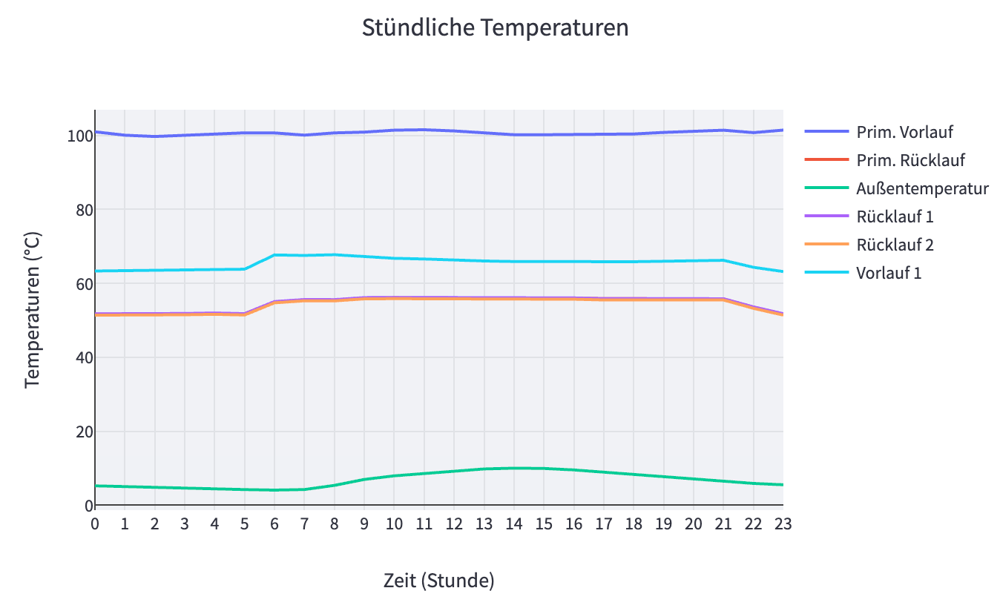

# Heat Meter Dashboard

A Streamlit-based interactive dashboard to visualize heat meter data, including load profiles, monthly average temperature and total energy consumption, and hourly temperature.

The dashboard can be accessed [here](https://khanhhuy288-msg-heatmeter-app-r50271.streamlit.app/).


## Features

- Interactive filters to select date ranges and heating season.
    

- Load profile chart showing average hourly load for weekdays, Saturdays, Sundays, and holidays.
    

- Chart displaying monthly average temperature and total energy consumption.
    

- Hourly temperature chart for various temperature parameters.
    

# Installation

1. Clone the repository or download the source code.

```bash
git clone https://github.com/khanhhuy288/msg-heatmeter.git
```

2. Navigate to the project directory.

```bash
cd msg-heatmeter
```

3. Install the required `default` and `develop` packages and create a virtual environment using `pipenv`. Don't use the `--dev` flag if you don't want to install the development packages.

```bash
pipenv install --dev
```

4. Activate the virtual environment.

```bash
pipenv shell
```

## Usage

1. Run the Streamlit app.

```bash
streamlit run app.py
```

2. Open the provided URL in your web browser to access the dashboard.

## Customization

You can customize the dashboard by modifying the source code files:

- `app.py`: Main application file.
- `data_processing.py`: Contains functions to process and filter data.
- `charts.py`: Contains functions to create Plotly charts.
- `sidebar.py`: Contains the function to create the sidebar.

# Deployment

Deploy your Streamlit app to Streamlit Cloud, which allows you to easily share your dashboard with others.

## Deployment Steps

1. Initialize a new Git repository in your project directory if it isn't already a Git repository.

```bash
git init
```

2. Add the project files to the Git repository.

```bash
git add .
```

3. Commit the changes.

```bash
git commit -m "Initial commit"
```

4. Create a new repository on GitHub.

5. Link your local repository to the remote repository.

```bash
git remote add origin https://github.com/yourusername/msg-heatmeter.git
```

Make sure to replace `https://github.com/yourusername/msg-heatmeter.git` with your repository URL.

6. Push your local repository to the remote repository.

```bash
git push -u origin master
```

7. Sign up for a [Streamlit Cloud](https://streamlit.io/cloud) account.

8. Log in to your Streamlit Cloud account and navigate to the [Dashboard](https://share.streamlit.io/).

9. Click the "New app" button in the top right corner.

10. Choose a repository from the "Repository" dropdown. You should see the repository you created in step 4.

11. Select the branch you want to deploy (usually `main`).

12. Specify the file path to your `app.py` file in the "File path" field.

13. Click the "Deploy" button. Streamlit Cloud will create a new app and provide you with a shareable URL. Any time you do a `git push`, your app will update immediately.

14. Share the URL with others to let them access your Heat Meter Dashboard.

For more information on deploying Streamlit apps to Streamlit Cloud, refer to the [official documentation](https://docs.streamlit.io/en/stable/deploy_streamlit_app.html).
